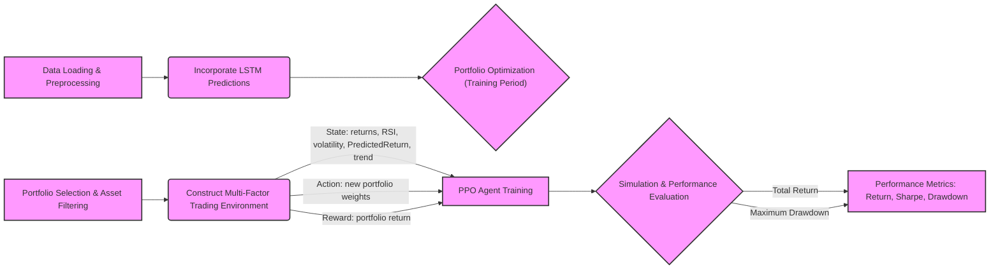

```mermaid
graph LR
    A[Data Loading & Preprocessing] --> B(Incorporate LSTM Predictions);
    B --> C{"Portfolio Optimization (Training Period)"};
    D[Portfolio Selection & Asset Filtering] --> E(Construct Multi-Factor Trading Environment);
    E -- State: returns, RSI, volatility, PredictedReturn, trend --> F;
    E -- Action: new portfolio weights --> F;
    E -- Reward: portfolio return --> F;
    F[PPO Agent Training] --> G{Simulation & Performance Evaluation};
    G -- Total Return --> H;
    G -- Maximum Drawdown --> H;
    H[Performance Metrics: Return, Sharpe, Drawdown];

    style A fill:#f9f,stroke:#333,stroke-width:2px
    style B fill:#f9f,stroke:#333,stroke-width:2px
    style C fill:#f9f,stroke:#333,stroke-width:2px
    style D fill:#f9f,stroke:#333,stroke-width:2px
    style E fill:#f9f,stroke:#333,stroke-width:2px
    style F fill:#f9f,stroke:#333,stroke-width:2px
    style G fill:#f9f,stroke:#333,stroke-width:2px
    style H fill:#f9f,stroke:#333,stroke-width:2px
```