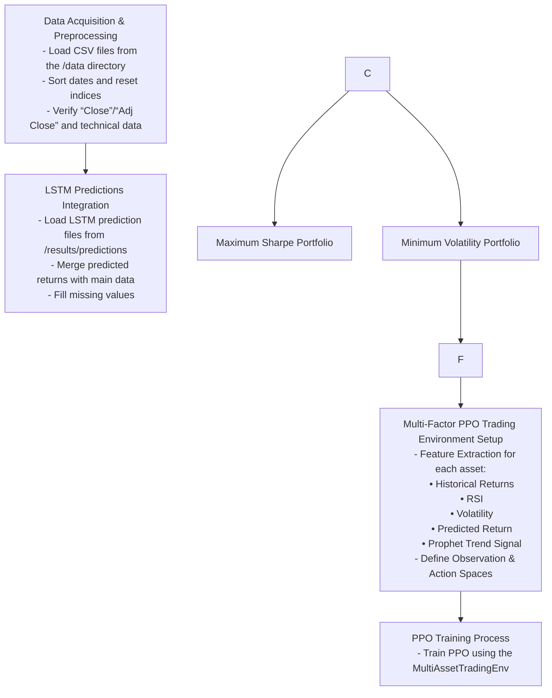

```mermaid
graph TD
    A[Data Acquisition & Preprocessing
    - Load CSV files from the /data directory
    - Sort dates and reset indices
    - Verify “Close”/“Adj Close” and technical data] --> B[LSTM Predictions Integration
    - Load LSTM prediction files from /results/predictions
    - Merge predicted returns with main data
    - Fill missing values]
    C --> D[Maximum Sharpe Portfolio]
    C --> E[Minimum Volatility Portfolio]
    E --> F
    F --> G[Multi-Factor PPO Trading Environment Setup
    - Feature Extraction for each asset:
        • Historical Returns
        • RSI
        • Volatility
        • Predicted Return
        • Prophet Trend Signal
    - Define Observation & Action Spaces]
    G --> H[PPO Training Process
    - Train PPO using the MultiAssetTradingEnv]
```